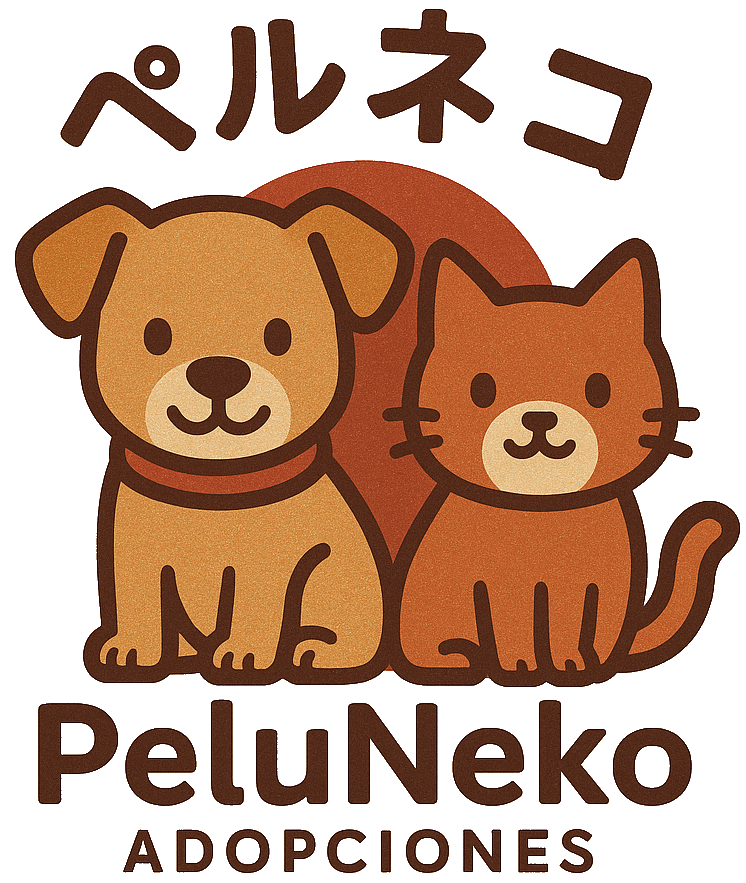

  

  
Aplicación de escritorio desarrollada con JavaFX para la gestión de un refugio de animales , tanto su registro de animales abandonados
como los nuevos dueño y los voluntarios del centro.
Para entrar en la aplicacion seria necesaria un inicio de sesión y segun el rol (Administrador , voluntario) para ver unos botones de
los voluntarios del centro y el login de los mismos (Solo rol de administrador).
Tendria una pestaña para las adopciones de los animales relacionadas con los nuevos dueños para tener un registro de todas las adopciones
realizadas.

---

## 🛠️ Tecnologías utilizadas

- **JavaFX** – Interfaz gráfica moderna para aplicaciones de escritorio.
- **MySQL** – Base de datos relacional para el almacenamiento estructurado de datos , realizado de forma local
  con la posibilidad de realizarlo de forma online.
- **IntelliJ IDEA** – Entorno de desarrollo utilizado para la construcción del proyecto.
---

## 📦 Funcionalidades principales

- 📋 Registro , modificación y eliminacion de **Voluntarios y nuevos dueños**.
- 👥 Gestión de **Adopciones realizadas**.
- 🔍 Búsqueda y filtrado de datos para facilitar el trabajo de los **voluntarios**.

---

## 📂 Estructura del proyecto
- Estructura realizada en MVC
