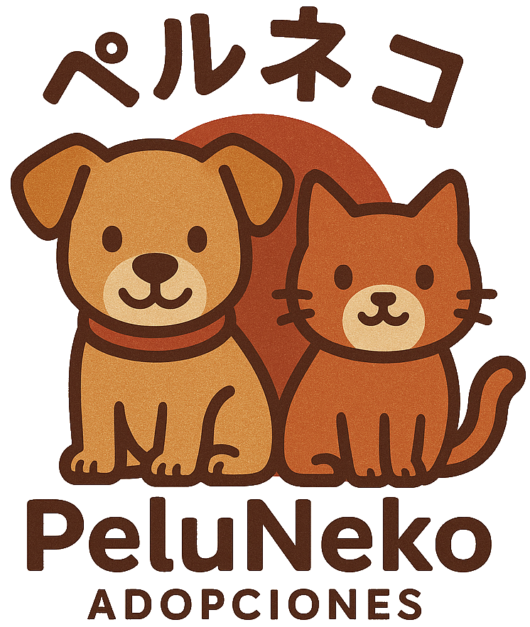

  

**Proyecto en proceso de creación**  
Aplicación de escritorio desarrollada con JavaFX para la gestión integral de un refugio de animales.  
Permite controlar adopciones, registrar nuevos propietarios y gestionar los voluntarios de cada centro.

---

## 🛠️ Tecnologías utilizadas

- **JavaFX** – Interfaz gráfica moderna para aplicaciones de escritorio.
- **MySQL** – Base de datos relacional para el almacenamiento estructurado de datos.
- **Hibernate ORM** – Mapeo objeto-relacional para simplificar la interacción con la base de datos.
- **IntelliJ IDEA** – Entorno de desarrollo utilizado para la construcción del proyecto.

---

## 📦 Funcionalidades principales

- 📋 Registro y modificación de **animales** disponibles para adopción.
- 👥 Gestión de **propietarios** y sus respectivas adopciones.
- 💼 Control de **voluntarios** por centro.
- 🏠 Administración de **centros de refugio**.
- 🔍 Búsqueda y filtrado de datos para facilitar el trabajo del personal.
- ✅ Validación de formularios y control de errores de entrada.

---

## 📂 Estructura del proyecto
- Estructura realizada en MVC
